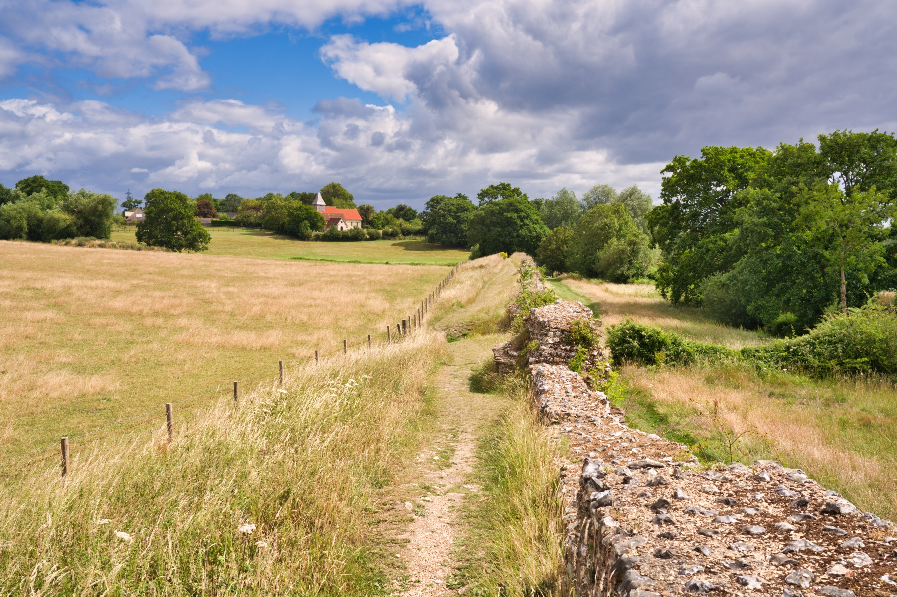
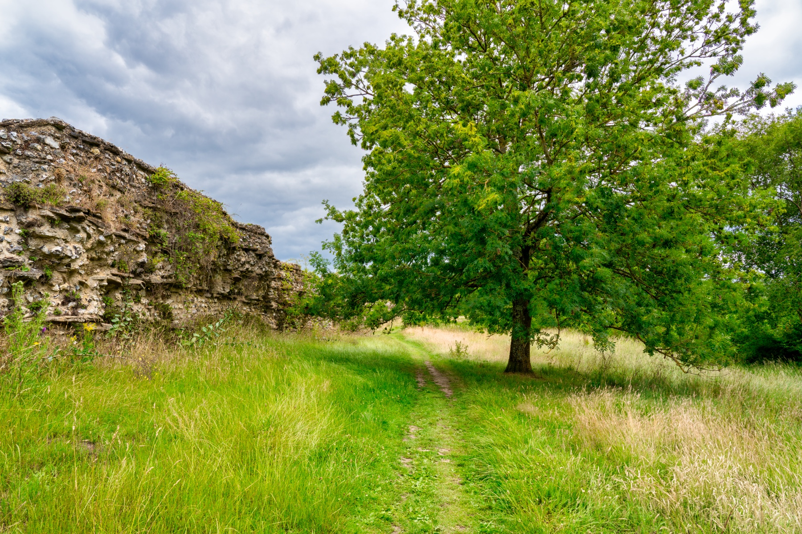

This post will evolve over time as I am going to pick a few locations that I love and visit them at different times of the year to take the same scene throughout the seasons. In this case I've visited Silchester and picked outa few different spots in the same vicinity. Each time I update the post, I shall change the date and share via my social media channels, as we go along. Follow my blog to learn of other locations I pick for this project across Hampshire, Surrey, Dorset and Berkshire (my stomping ground!).

## UPDATE: 30th July 2020

It was a delight to re-visit the site and to meet up with my brother Tim who hadn’t been out of his London apartment on his own since March. My niece (his daughter) Izzie has just gone back to nursery and his wife back at work. So he grabbed his sound recording gear (he is a freelance recordist of sound waves) and joined me with my light to pixel gathering equipment! We consequently began recording a Podcast which we need to edit and remove some of the chat where we ranted about Boris purely in the expletive. We mostly perambulated the 2000 year old walls and talked about how weird the freelance photography, web and sound recording world has become. A number of people asking if we were making a documentary and a father and daughter educated on how great the business is. I am now imagining a young girl asking her father if she can have a microphone boom and mixer for her eighth birthday. 

It was utterly hot and very bright. I drank water like there was no tomorrow (thankfully this was all yesterday and everything seems to have survived the night, so there was no need after all of that). Photography didn’t really happen but I did manage to lose things such as my sunglasses but I did find them later which was a baffling relief. 

I sent the drone up into the sky that seemed to be very bereft of aircraft or perhaps glad to see the back of them. Is it just me or are the clouds these days so much better for it? I commented to my brother by saying, “I think the sky is really enjoying itself and is doodling happier clouds”. Ok that sounds a little bit whacky but my sense of humour was tuned to the scale of Milligan and Python back in my childhood days. Hence I am a bit of a loon at times!

After editing and what have you these are my photos!

__Coming later__ 
