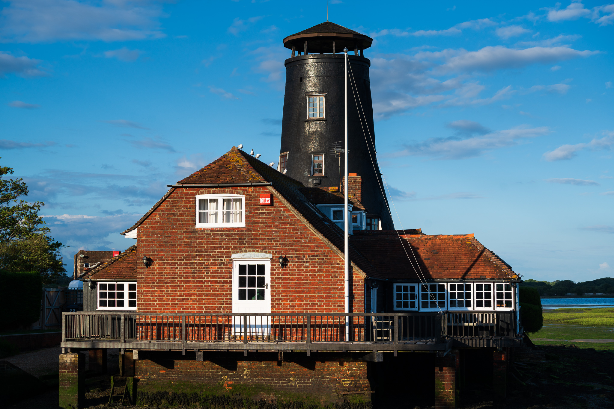
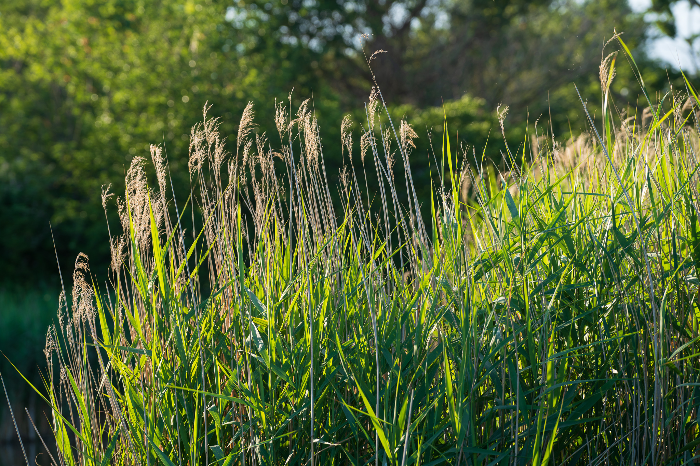
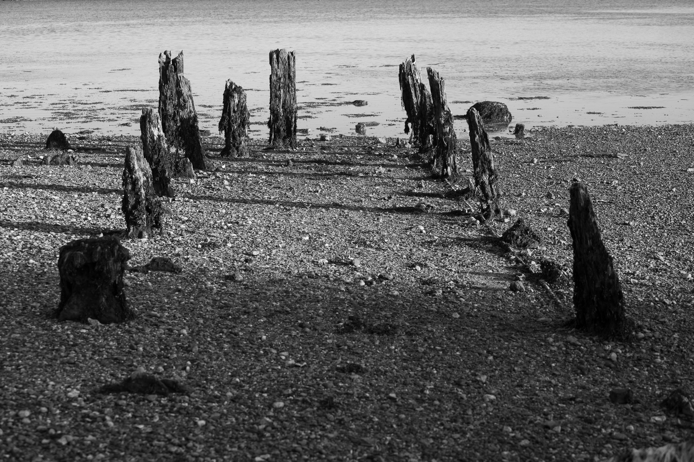
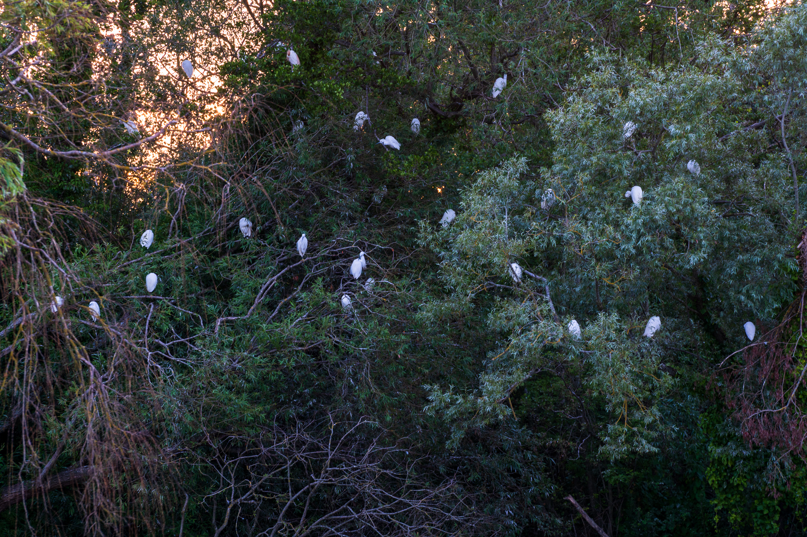

## July 2020

So a new month begins and the pandemic lockdown conditions ensue here in England, albeit with certain freedoms being gradually reinstated. I am able to get out once a day for exercise with a bit more flexibility to do certain things. 

A year or so ago, January 2019 to be precise, I found a great walk along our coastline, here in Hampshire that I hadn't returned to. So it was great to revisit the section of the coastal path between Langstone Harbour and Emsworth which takes you through Warblington.

Langstone Mill is an interesting building and something of a landmark. One of those locations I think I will photograph again at different times of the year. The tide was out when we arrived and that was handy because I could get down onto the shingly sand and avoid a bit of the path which isn't wide enough for social distancing. A pub near by has been serving takeaway drinks and food and just two days before it would have opened it's doors properly since the start of the lockdown in March.

