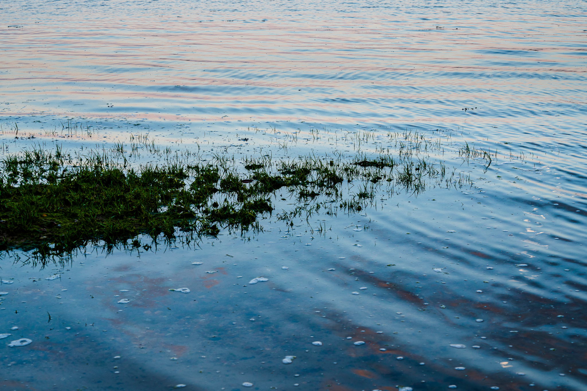

## July 2020

So a new month begins and the pandemic lockdown conditions ensue here in England, albeit with certain freedoms being gradually reinstated. I am able to get out once a day for exercise with a bit more flexibility to do certain things.

A year or so ago, January 2019 to be precise, I found a great walk along our coastline, here in Hampshire that I hadn't returned to. So it was great to revisit the section of the coastal path between Langstone Harbour and Emsworth which takes you through Warblington.

Langstone Mill is an interesting building and something of a landmark. One of those locations I think I will photograph again at different times of the year. The tide was out when we arrived and that was handy because I could get down onto the shingly sand and avoid a bit of the path which isn't wide enough for social distancing. A pub near by has been serving takeaway drinks and food and just two days before it would have opened it's doors properly since the start of the lockdown in March.

Just behind the mill is of course, the mill-pond which merges into a nature reserve just behind it. The sun setting over towards the west, casting a nice warm glow over these summer reeds.

The Solent coastline is scattered with the remains of old barges and forms of boat. Many have gradually become submerged into the sand upon which they've come to rest. Combined of course with the ebb and flow of the tides over time. Seeweed gradually staking it's claim over the decaying timbers.

Plenty of ideas here for this particular visit and those to come in the future. I can remember a wreck we came across last year in the estuary of the River Hamble that I took a closer look at with the drone. Something I am itching to do as it becomes safe to do so.

I am always drawn to crops as a photographer and I think they make fabulous abstracts. Not to mention observing how the passing time of the seasons, as their colour changes, they grow, they are harvested and fade away.

Landscapes are always exciting for that reason. It's worth picking some local landscapes to visit at intermittent intervals throughout the year. Give it a try!

We had been walking along the coast towards Emsworth for quite awhile and if I am being honest, all hope had been lost for a dramtic shot. The light had gone, the clouds to the west loomed heavily on the horizon.

It wasn't until we came off the coastal route to head inland, that things began to change and very quickly they did too. I love those moments when you detect a slight change in the light and you get an inkling that the sun may break through.

We stopped in our tracks as we  walked along the footpath, nestled between crops and hedgerows. I hastily set up my tripod, seeing that the sune would come and go in a flash. I was ill-prepared! I decided to go with my 70-200mm, purely because it was already mounted and composed the shot you see above.

It's important tp point out that I used no filters on this shot at all, I just knocked the dial down by 2 stops to emphasise the sky and register the silhoutte. Later in post I cropped some unwanted details out in the forground and made some minor curves adjustments!

Whilst we had stopped in the field the crops just popped in the glorious light. So we stayed awhile and admired it. Going back to my earlier comments in this article, I now imagine how this field will look in several weeks time, golden ready for harvesting. The last time I visited this location was in January 2019 when it all looked totally different.

We were blown away by the sight of this large "Egrety". Is that the right name for one of these? After all Herons nest in what we call a Heronry. We sat and watched them for quite awhile, gracefully gliding into roost looking startingly alike their ancient ancestors. It was a difficult shot given the fact the longest lens I have is a 200 and with so many active subjects in the frame, I suspected it would look disappointing when viewing it on the computer back home. It came out really well, pleased as punch with it!

